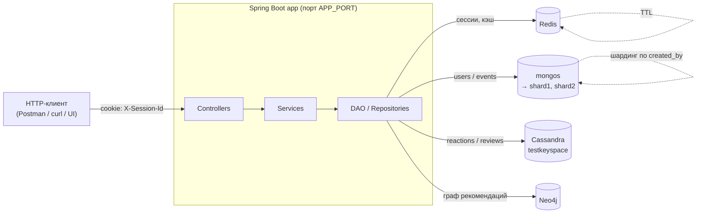
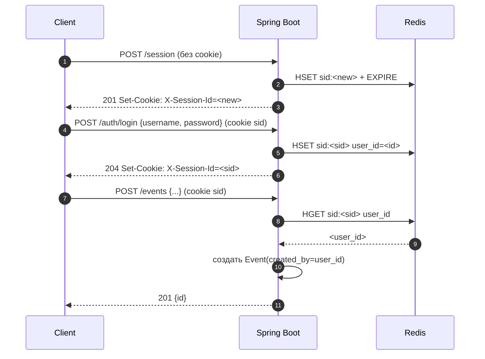
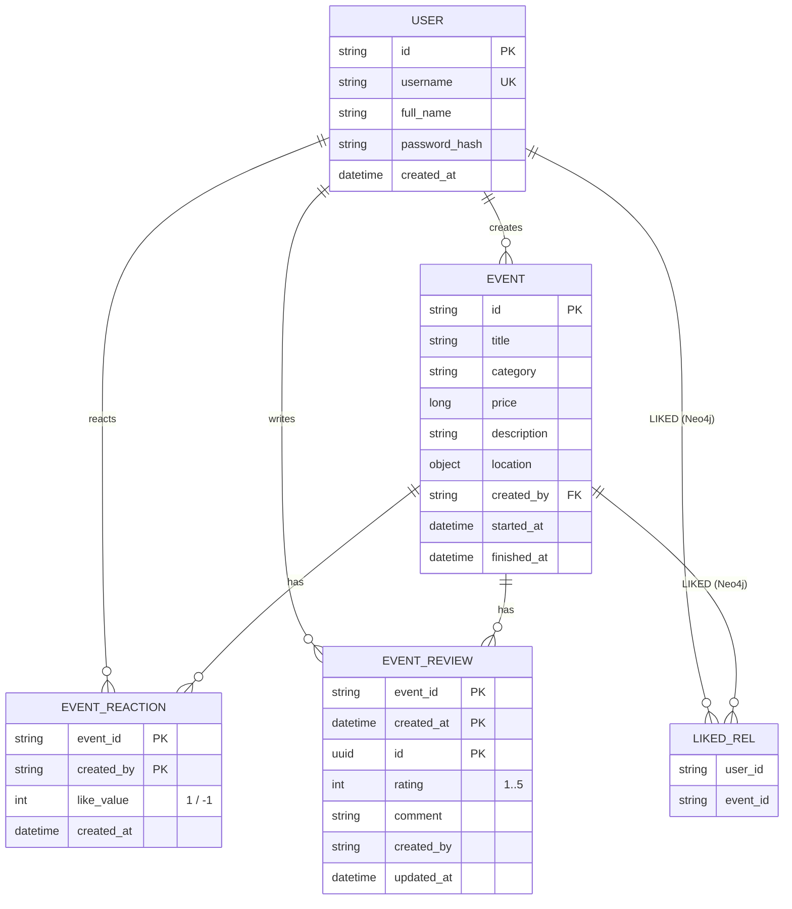

# EventHub

> REST API платформы мероприятий: пользователи, события, реакции, отзывы и рекомендации поверх MongoDB, Redis, Cassandra и Neo4j.

[](https://github.com/Vanmors/ndbx/actions/workflows/eventhub.yml)
[](./pom.xml)
[](https://adoptium.net/)
[](https://spring.io/projects/spring-boot)
[](./docker-compose.yml)

---

## Содержание

- [Технологический стек](#технологический-стек)
- [Архитектура проекта](#архитектура-проекта)
- [Функциональные требования / Use Cases](#функциональные-требования--use-cases)
- [API](#api)
- [Инструкция по запуску](#инструкция-по-запуску)
- [Конфигурация](#конфигурация)
- [Тестирование](#тестирование)
- [FAQ](#faq)
- [Лицензия](#лицензия)

---

## Технологический стек

| Слой | Технология | Назначение |
|------|-----------|-----------|
| Язык / runtime | **Java 17** (Eclipse Temurin) | Основной язык |
| Фреймворк | **Spring Boot 4.x** | DI, web, validation, security, data |
| Сборка | **Maven 3.9** | Multi-stage Docker build |
| Хранилище (главное) | **MongoDB 8.0** (sharded: 2 шарда × 3 реплики + config + mongos) | Пользователи, мероприятия |
| Сессии и кэш | **Redis 8.0** | Сессии, Cache-Aside для реакций/отзывов/рекомендаций |
| Хранилище реакций/отзывов | **Apache Cassandra 4.1** | `event_reactions`, `event_reviews` (write-heavy) |
| Граф рекомендаций | **Neo4j 5 Community** | `(User)-[:LIKED]->(Event)`, collaborative filtering |
| API-документация | **springdoc-openapi 2.8** | Swagger UI и `/v3/api-docs` |
| Валидация | **Jakarta Validation** | DTO request-валидация |
| Хеш паролей | **BCrypt** (strength 10) | Хранение `password_hash` |
| Сериализация | **Jackson 2.21** | JSON in/out |
| Контейнеризация | **Docker + docker-compose** | Запуск всего стека |
| Автоматизация | **Make** | Тонкая обёртка над docker compose |

---

## Архитектура проекта

### Структура пакетов

```
src/main/java/com/vanmors/ndbx/
├── Application.java                  # Точка входа Spring Boot
├── config/                           # @Configuration: MongoDB / Redis / Cassandra / Neo4j / Security / Web
├── controller/                       # @RestController — HTTP-слой
│   ├── response/                     # Response-обёртки (EventsResponse, ErrorResponse, ...)
│   ├── CookieBuilder.java            # Сборка cookie X-Session-Id
│   └── GlobalExceptionHandler.java   # @RestControllerAdvice — централизованные ошибки
├── converter/                        # Mongo read/write конвертеры для Category (toleration-friendly)
├── dao/                              # Spring Data репозитории + кастомный SessionDao на Lua-скриптах
│   └── impl/                         # Реализации (SessionDaoImpl)
├── dto/                              # Request/Response DTO (record + Jakarta Validation)
├── entity/                           # @Document (Mongo), @Table (Cassandra), @Node (Neo4j)
├── service/                          # Интерфейсы бизнес-логики
│   ├── exception/                    # AlreadyExists, Unauthorized, Registration
│   └── impl/                         # Реализации сервисов
└── utils/                            # DateUtils (YYYYMMDD → Instant)

src/main/resources/
└── application.properties            # Подтягивает env через ${...}
```

Принципы:
- **Слоистая архитектура** controller → service → dao. Бизнес-логика и проверки авторизации — в сервисах, не во фильтрах Spring Security.
- **Аутентификация — cookie-сессии**, без JWT. Кука `X-Session-Id` (HttpOnly, SameSite=Lax).
- **Полиглот-персистентность**: разные базы под разные паттерны доступа.
- **Cache-Aside**: горячие данные (реакции, отзывы, рекомендации) кэшируются в Redis с TTL.

### Схема взаимодействия компонентов



### Поток сессии и авторизации



### Основные сущности



Подробная DBML-схема (для импорта в [dbdiagram.io](https://dbdiagram.io/home)) — в [`docs/schema.dbml`](./docs/schema.dbml).

---

## Функциональные требования / Use Cases

| # | Кто | Что хочет | Эндпоинт |
|---|-----|-----------|----------|
| UC-1 | Гость | Получить анонимную сессию для дальнейшей работы | `POST /session` |
| UC-2 | Гость | Зарегистрироваться | `POST /users` |
| UC-3 | Гость | Войти под своим аккаунтом | `POST /auth/login` |
| UC-4 | Пользователь | Выйти из аккаунта | `POST /auth/logout` |
| UC-5 | Пользователь | Создать мероприятие | `POST /events` |
| UC-6 | Пользователь | Редактировать своё мероприятие | `PATCH /events/{id}` |
| UC-7 | Любой | Искать мероприятия по фильтрам (категория, город, цена, даты, автор) | `GET /events` |
| UC-8 | Любой | Открыть карточку мероприятия с реакциями/отзывами | `GET /events/{id}?include=reactions,reviews` |
| UC-9 | Пользователь | Поставить лайк / дизлайк (повторный вызов перезаписывает) | `POST /events/{id}/like`, `POST /events/{id}/dislike` |
| UC-10 | Пользователь | Оставить один отзыв с рейтингом 1..5 | `POST /events/{id}/reviews` |
| UC-11 | Автор отзыва | Отредактировать свой отзыв | `PATCH /events/{eventId}/reviews/{reviewId}` |
| UC-12 | Любой | Получить отзывы мероприятия с пагинацией | `GET /events/{id}/reviews` |
| UC-13 | Пользователь | Получить персональные рекомендации (collaborative filtering) | `GET /recommendations` |
| UC-14 | Любой | Посмотреть пользователя и его мероприятия | `GET /users/{id}`, `GET /users/{id}/events` |
| UC-15 | Любой | Проверить, что сервис жив | `GET /health` |

**Алгоритм рекомендаций (Neo4j).**
1. Находим события, которые лайкнул текущий пользователь.
2. Находим других пользователей, лайкнувших те же события.
3. Берём их остальные лайки, исключая уже лайкнутые текущим.
4. Сортируем по числу лайков (по убыванию популярности).
5. Дедупликация по `title` — оставляем ближайшее по дате начала.

Результат кэшируется в Redis (`user:{user_id}:recomms`) с TTL `APP_RECOMMENDATIONS_TTL`. Дизлайки не разрывают связь `LIKED` (в формуле учитываются только лайки).

---

## API

### Swagger UI и OpenAPI

После запуска сервиса (`make run`) доступны:

- **Swagger UI** → <http://localhost:8081/swagger-ui.html>
- **OpenAPI JSON** → <http://localhost:8081/v3/api-docs>
- **Статичная OpenAPI 3.0 спецификация** → [`api/openapi.yaml`](./api/openapi.yaml)

> Спецификация в `api/openapi.yaml` содержит все эндпоинты, схемы DTO и **примеры запросов/ответов**. Её можно открыть в любом редакторе Swagger (например, <https://editor.swagger.io>) или импортировать в Postman.

### Сводная таблица эндпоинтов

| Метод | Эндпоинт | Auth | Описание |
|-------|----------|:----:|----------|
| `GET`  | `/health` | — | Health-check |
| `POST` | `/session` | — | Создать/продлить анонимную сессию |
| `POST` | `/auth/login` | — | Войти |
| `POST` | `/auth/logout` | — | Выйти (cookie max-age=0) |
| `POST` | `/users` | — | Регистрация |
| `GET`  | `/users` | — | Список пользователей (фильтры: `name`, `id`) |
| `GET`  | `/users/{id}` | — | Пользователь по ID |
| `GET`  | `/users/{id}/events` | — | Мероприятия пользователя (`?include=reactions,reviews`) |
| `POST` | `/events` | ✅ | Создать мероприятие |
| `GET`  | `/events` | — | Список с фильтрами `title`, `category`, `city`, `price_from/to`, `date_from/to`, `user`, `include` |
| `GET`  | `/events/{id}` | — | Карточка мероприятия (`?include=reactions,reviews`) |
| `PATCH`| `/events/{id}` | ✅ | Обновить (только владелец) |
| `POST` | `/events/{id}/like` | ✅ | Лайк |
| `POST` | `/events/{id}/dislike` | ✅ | Дизлайк |
| `POST` | `/events/{id}/reviews` | ✅ | Оставить отзыв (один на пользователя) |
| `GET`  | `/events/{id}/reviews` | — | Список отзывов |
| `PATCH`| `/events/{eventId}/reviews/{reviewId}` | ✅ | Редактировать свой отзыв |
| `GET`  | `/recommendations` | ✅ | Персональные рекомендации |

Параметры пагинации (где применимо): `limit` (по умолчанию `10`), `offset` (по умолчанию `0`).
Формат дат для фильтров: `YYYYMMDD` (например, `date_from=20260101`).

### Примеры запросов

#### 1. Создать анонимную сессию

```bash
curl -i -c cookies.txt -X POST http://localhost:8081/session
```

```http
HTTP/1.1 201 Created
Set-Cookie: X-Session-Id=8f3c1a2b-...; Path=/; HttpOnly; SameSite=Lax
```

#### 2. Регистрация

```bash
curl -i -b cookies.txt -c cookies.txt \
  -X POST http://localhost:8081/users \
  -H 'Content-Type: application/json' \
  -d '{"full_name":"Alice Liddell","username":"alice","password":"S3cret!"}'
```

#### 3. Вход

```bash
curl -i -b cookies.txt -c cookies.txt \
  -X POST http://localhost:8081/auth/login \
  -H 'Content-Type: application/json' \
  -d '{"username":"alice","password":"S3cret!"}'
```

Возможный ответ при ошибке:

```json
{ "message": "invalid credentials" }
```

#### 4. Создать мероприятие

```bash
curl -i -b cookies.txt \
  -X POST http://localhost:8081/events \
  -H 'Content-Type: application/json' \
  -d '{
    "title": "Spring Boot Meetup",
    "category": "meetup",
    "price": 0,
    "description": "Доклады по Spring Boot",
    "location": {"city": "Saint Petersburg", "address": "ул. Большая Морская, 67"},
    "started_at": "2026-09-12T18:00:00Z",
    "finished_at": "2026-09-12T21:00:00Z"
  }'
```

```json
{ "id": "65fb3d1e9a1c2b3d4e5f6a78" }
```

#### 5. Список мероприятий с реакциями и отзывами

```bash
curl -s "http://localhost:8081/events?category=meetup&city=Saint%20Petersburg&include=reactions,reviews&limit=10"
```

```json
{
  "events": [
    {
      "id": "65fb3d1e9a1c2b3d4e5f6a78",
      "title": "Spring Boot Meetup",
      "category": "meetup",
      "price": 0,
      "location": { "city": "Saint Petersburg", "address": "ул. Большая Морская, 67" },
      "created_at": "2026-06-08T12:00:00Z",
      "created_by": "65f8a1b2c3d4e5f6a7b8c9d0",
      "started_at": "2026-09-12T18:00:00Z",
      "finished_at": "2026-09-12T21:00:00Z",
      "reactions": { "likes": 42, "dislikes": 3 },
      "reviews":   { "count": 5,  "rating": 4.6 }
    }
  ],
  "count": 1
}
```

#### 6. Лайк / отзыв

```bash
curl -i -b cookies.txt -X POST http://localhost:8081/events/65fb3d1e9a1c2b3d4e5f6a78/like

curl -i -b cookies.txt \
  -X POST http://localhost:8081/events/65fb3d1e9a1c2b3d4e5f6a78/reviews \
  -H 'Content-Type: application/json' \
  -d '{"comment":"Прекрасное событие","rating":5}'
```

#### 7. Рекомендации

```bash
curl -s -b cookies.txt http://localhost:8081/recommendations
```

```json
{
  "events": [
    { "id": "...", "title": "Java Conf 2026", "category": "concert", "reactions": { "likes": 120, "dislikes": 4 } }
  ]
}
```

---

## Инструкция по запуску

### Предварительные требования

- **Docker Desktop** (Docker Engine ≥ 24) c включённым `docker compose`
- **GNU Make** (на macOS уже есть; на Windows — через WSL2 / Git Bash)
- Свободные порты: `8081` (app), `6379` (Redis), `27017` (mongos), `9042` (Cassandra), `7474`/`7687` (Neo4j) и `27100–27106` (Mongo config + шарды)
- Минимум **6 ГБ RAM** для Docker (поднимается 13 контейнеров, включая Cassandra и Neo4j)

### Пошаговый запуск

1. **Склонировать репозиторий**
   ```bash
   git clone https://github.com/Vanmors/ndbx.git
   cd ndbx
   ```

2. **Проверить переменные окружения**
   Файл [`.env.local`](./.env.local) уже содержит локальные значения по умолчанию. При необходимости измените порты или пароли.

3. **Запустить весь стек**
   ```bash
   make run
   ```
   Команда выполнит:
   - сборку приложения (`mvn clean package -DskipTests` в multi-stage Dockerfile),
   - подъём Mongo config + 6 шардов + mongos,
   - инициализацию replica sets и шардирования (`mongo-cluster-init.sh`),
   - подъём Redis, Cassandra, Neo4j,
   - инициализацию keyspace и таблиц Cassandra (`cassandra-init.sh`),
   - старт приложения после `healthcheck` всех зависимостей.

4. **Дождаться запуска (~1–2 минуты при первом старте)**
   ```bash
   make services       # увидеть статусы
   curl http://localhost:8081/health
   # → {"status":"ok"}
   ```

5. **Открыть Swagger UI** → <http://localhost:8081/swagger-ui.html>

### Полезные команды

```bash
make run       # build + up -d
make rund      # up без detach (для просмотра логов)
make services  # docker compose ps
make stop      # down (volumes сохраняются)
make clean     # down -v (полная очистка БД)
```

### Отладка

- Логи приложения: `docker compose logs -f app`
- Зайти в mongos: `docker compose exec mongos mongosh --port 27017`
- CQL-консоль Cassandra: `docker compose exec cassandra-test cqlsh -e "USE testkeyspace; DESCRIBE TABLES;"`
- Neo4j Browser: <http://localhost:7474> (login `neo4j` / `password`)

---

## Конфигурация

Все настройки задаются через [`.env.local`](./.env.local) и пробрасываются в контейнеры. `application.properties` подставляет их через `${...}`.

### Приложение

| Переменная | Описание | Значение по умолчанию |
|------------|----------|----------------------|
| `APP_PORT` | Порт HTTP-сервера приложения | `8081` |
| `APP_HOST` | Хост для внутренних healthcheck | `127.0.0.1` |
| `APP_USER_SESSION_TTL` | TTL сессии в Redis, секунды | `60` |
| `APP_LIKE_TTL` | TTL кэша реакций, секунды | `60` |
| `APP_EVENT_REVIEWS_TTL` | TTL кэша отзывов, секунды | `120` |
| `APP_RECOMMENDATIONS_TTL` | TTL кэша рекомендаций, секунды | `60` |

### Redis

| Переменная | Описание | Значение по умолчанию |
|------------|----------|----------------------|
| `REDIS_HOST` | Хост Redis | `redis` |
| `REDIS_PORT` | Порт Redis | `6379` |
| `REDIS_PASSWORD` | Пароль (пусто = без auth) | *(empty)* |
| `REDIS_DB` | Номер базы Redis | `0` |

### MongoDB

| Переменная | Описание | Значение по умолчанию |
|------------|----------|----------------------|
| `MONGODB_HOST` | Хост mongos | `mongos` |
| `MONGODB_PORT` | Порт mongos | `27017` |
| `MONGODB_DATABASE` | Имя базы | `eventhub` |
| `MONGODB_USER` | Пользователь MongoDB | `eventhub` |
| `MONGODB_PASSWORD` | Пароль MongoDB | `eventhub` |
| `MONGO_CFG_PORT` | Порт config-сервера | `27100` |
| `MONGO_SHARD1A_PORT`..`MONGO_SHARD1C_PORT` | Порты реплик shard1 | `27101`..`27103` |
| `MONGO_SHARD2A_PORT`..`MONGO_SHARD2C_PORT` | Порты реплик shard2 | `27104`..`27106` |

### Cassandra

| Переменная | Описание | Значение по умолчанию |
|------------|----------|----------------------|
| `CASSANDRA_HOSTS` | Список contact-points | `cassandra-test` |
| `CASSANDRA_PORT` | Порт CQL | `9042` |
| `CASSANDRA_KEYSPACE` | Keyspace | `testkeyspace` |
| `CASSANDRA_USERNAME` | Логин | *(empty)* |
| `CASSANDRA_PASSWORD` | Пароль | *(empty)* |
| `CASSANDRA_CONSISTENCY` | Уровень консистентности | `ONE` |
| `CASSANDRA_LOCAL_DATACENTER` | Имя локального ДЦ | `datacenter1` |

### Neo4j

| Переменная | Описание | Значение по умолчанию |
|------------|----------|----------------------|
| `NEO4J_HOST` | Хост Neo4j | `neo4j` |
| `NEO4J_HTTP_PORT` | Порт HTTP (Browser) | `7474` |
| `NEO4J_BOLT_PORT` | Порт bolt-протокола | `7687` |
| `NEO4J_USERNAME` | Пользователь | `neo4j` |
| `NEO4J_PASSWORD` | Пароль | `password` |

---

## Тестирование

> На текущем этапе курса автоматизированные тесты в проекте отсутствуют — лабораторная фокусируется на интеграции NoSQL-хранилищ. Ниже — план тестирования и способ ручной проверки.

### Ручная проверка

1. `make clean && make run` — поднять чистый стек.
2. Дождаться `curl http://localhost:8081/health` → `{"status":"ok"}`.
3. Прогнать сценарий из раздела [Примеры запросов](#примеры-запросов) (`session → register → login → create event → like → review → recommendations`).
4. Импортировать [`api/openapi.yaml`](./api/openapi.yaml) в Postman или Swagger Editor и пройти эндпоинты.

### Что **не** покрыто

- Юнит-тестов нет (нет каталога `src/test`).
- Интеграционных тестов нет — заменяются ручной проверкой против поднятого `docker compose`.
- Приёмочные тесты выполняются CI-скриптом из репозитория курса (см. `.github/`); он опирается на `.labrc` (`LAB=7`).

### Куда логичнее добавить тесты в будущем

| Слой | Инструмент |
|------|-----------|
| Контроллеры | `@WebMvcTest` + MockMvc |
| Сервисы | JUnit 5 + Mockito |
| DAO MongoDB | Testcontainers (Mongo) |
| DAO Cassandra | Testcontainers (Cassandra) |
| Neo4j | Testcontainers (Neo4j) |
| End-to-end | REST Assured против `docker compose up` |

---

## FAQ

**Q: Как сбросить состояние БД?**
A: `make clean` — удаляет все docker volumes (Mongo / Neo4j / Cassandra). Redis работает без persist-volume, поэтому очищается при перезапуске контейнера.

**Q: Где взять `X-Session-Id` для запросов?**
A: Сначала вызвать `POST /session` — в ответе придёт `Set-Cookie: X-Session-Id=...`. Cookie HttpOnly, SameSite=Lax. В Postman включите автоматическое хранение cookies; в curl используйте `-b/-c`.

**Q: Почему Cassandra долго стартует?**
A: Образ `cassandra:4.1` прогревается ~30–60 секунд на свежем volume. Healthcheck с `start_period=40s` это учитывает; `app` ждёт `cassandra-init` через `depends_on: service_completed_successfully`.

**Q: Можно ли запустить приложение без Docker?**
A: Технически да (`mvn spring-boot:run`), но придётся вручную поднять Mongo (sharded), Redis, Cassandra и Neo4j и переопределить переменные окружения. Рекомендованный путь — `make run`.

**Q: Где смотреть схему БД визуально?**
A: Импортируйте [`docs/schema.dbml`](./docs/schema.dbml) в <https://dbdiagram.io/>. В VS Code схему можно открывать расширением *DBML Live Preview*.

**Q: Где скриншоты UI?**
A: Бэкенд UI не имеет. Скриншоты Swagger UI и Neo4j Browser можно размещать в `docs/img/` и ссылаться отсюда.

**Q: На каком языке писать issue / PR?**
A: Русский или английский — на ваш выбор.

---

## Помощь

Возникли вопросы? → [@Vanmrkv](https://t.me/Vanmrkv)
